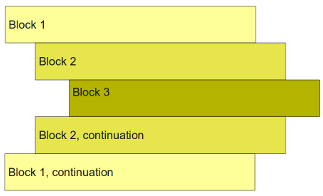

# Indentação no Python

O Python é uma linguagem que possui indentação por espaços, ou seja, se quisermos definir um bloco de código dentro de uma determinada instrução, devemos adicionar um nível de indentação em todo este bloco de código. Por exemplo, se quisermos imprimir uma determinada mensagem a depender do resultado de uma estrutura condicional, o código ficaria da seguinte maneira:

```
if (variável == 5):
      print("código indentado")

```


Dessa forma, o comando "código indentado" só será exibido caso a variável seja igual a 5. Sendo assim, devemos sempre indentar os blocos de código conforme visto na imagem abaixo:

